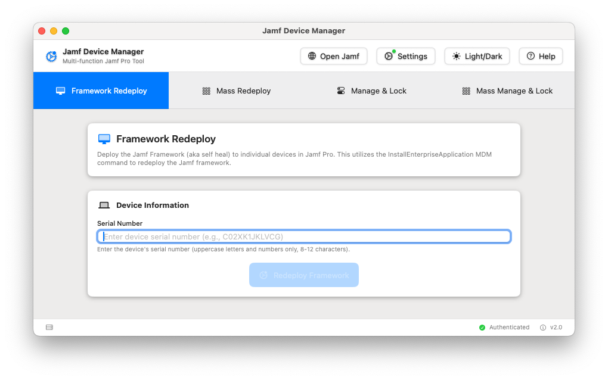
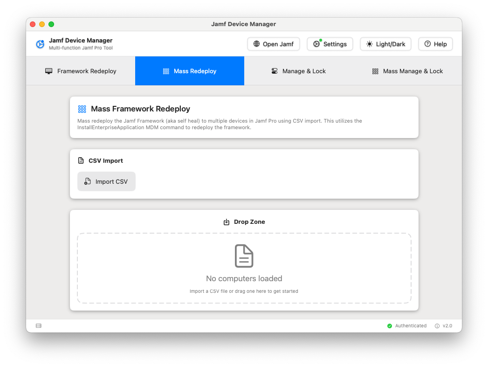
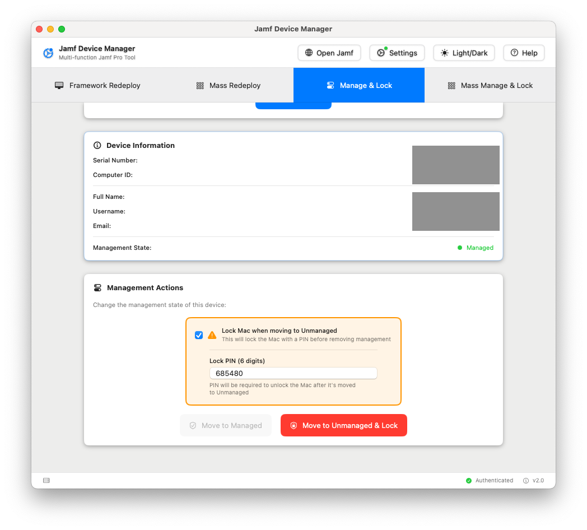

# Jamf Management Tool

The inspiration for this app is from the Jamf Framework Redeploy app
by red5coder.

Github: https://github.com/red5coder/Jamf-Framework-Redeploy

A comprehensive macOS application for managing Jamf Pro devices with both individual and bulk operations. Streamline framework redeploys, management state changes, and device locking operations through an intuitive interface.

## 🌟 Features

### 📊 Dashboards and Stats
- **Jamf Advanced search Dashboard**: View stats about Computers in Jamf
- **Filtering**: Filter the Advanced searches in Settings by prefix word

### 🔍 Search & Discovery
- **Jamf Search**: Search and browse devices directly from within the application
- **Device Information**: View comprehensive device details and user information
- **Real-time Device Status**: Live status updates and management state information

### 🔧 Framework Management
- **Single Device Redeploy**: Deploy Jamf framework to individual devices with real-time feedback
- **Bulk Framework Redeploy**: Mass deploy framework to multiple devices via CSV import

### 🔒 Device Management & Security
- **Management State Control**: Change device management states (managed/unmanaged)
- **Device Locking**: Lock devices with random PINs when moving to unmanaged state
- **User Information Display**: View comprehensive device and user details

### 📊 Bulk Operations
- **CSV Import Framework**: Drag-and-drop CSV support with comprehensive validation
- **Real-time Progress Tracking**: Live progress indicators for bulk operations
- **Detailed Error Reporting**: Specific failure reasons and comprehensive status updates
- **Jamf Pro Integration**: Direct links to device records in Jamf Pro

### 🎨 Modern User Experience
- **5-Tab Interface**: Organized workflow with Single Redeploy, Mass Redeploy, Manage & Lock, Mass Manage & Lock, and Jamf Search
- **Built-in Help System**: Comprehensive help documentation with contextual tooltips
- **Dark/Light Mode**: Automatic theme switching support
- **Professional Design**: Consistent design system with smooth animations

## 📷 Screenshots

### Main Interface
The modern 5-tab interface provides clear organization of all functionality:



### Dashboard
Stats and Charts


### Jamf Search
Simple search and Advanced search:


### Bulk Operations with Progress Tracking
Real-time progress monitoring for bulk operations:



### Device Management with Locking
Comprehensive device management with optional security features:



## 📋 Requirements

### System Requirements
- **macOS**: 13.0 or later
- **Memory**: 8 GB RAM minimum, 16 GB recommended
- **Storage**: 50 MB available disk space
- **Network**: Stable internet connection to Jamf Pro server

### Jamf Pro Requirements
- **Version**: Jamf Pro 10.25.0 or later (10.40.0+ recommended)
- **API Client**: OAuth 2.0 client with required permissions
- **MDM Framework**: Must be present on target devices


## 🚀 Quick Start

##### Note:
On download the .pkg. Your Mac may display a warning dialogue.


If so open your System Settings, goto Privacy and scroll down to the Security section and click Open Anyway and follow any other on screen prompts to allow the app to run.


### 1. Download and Install
- Download the latest release from the [Releases](../../releases) page
- Move the application to your Applications folder
- Launch "Jamf Management Tool"

### 2. Configure API Credentials
1. Click **Settings** (⚙️) or press `⌘,`
2. Enter your **Jamf Pro Server URL** (e.g., `https://yourcompany.jamfcloud.com`)
3. Add your **API Client ID** and **Client Secret**
4. Click **Test Connection** to verify
5. Click **Save & Close**

### 3. Choose Your Operation
- **Single Redeploy**: Individual device framework redeploy
- **Mass Redeploy**: Bulk framework operations via CSV
- **Manage & Lock**: Individual device management and locking  
- **Mass Manage & Lock**: Bulk management operations
- **Jamf Search**: Search and browse devices in your Jamf Pro environment

## 📄 CSV File Format

### Required Column
- `SerialNumber` - Device serial number (case-sensitive, uppercase)

### Optional Columns
- `ComputerName` - Display name for the device
- `Notes` - Additional information or comments

### Sample CSV
```csv
SerialNumber,ComputerName,Notes
C02XK1JKLVCG,John's MacBook Pro,Finance Department
FVFZM7LNKLHG,Jane's iMac,Marketing Team
G8WN0X9NHTD5,Bob's MacBook Air,Engineering Department
```

### Format Requirements
- File extension: `.csv`
- Character encoding: UTF-8
- Maximum file size: 10 MB
- Maximum devices: 1,000 per CSV

📥 **[Download Sample CSV Files](example%20csv/)**

## 🎯 Usage Guide

### Single Device Operations

#### Framework Redeploy
1. Navigate to **Single Redeploy** tab
2. Enter device serial number
3. Click **Redeploy Framework**
4. Monitor operation status

#### Device Management
1. Navigate to **Manage & Lock** tab
2. Enter device serial number
3. Click **Get Device Info** to view current state
4. Choose desired action (manage/unmanage/lock)

### Bulk Operations

#### Mass Framework Redeploy
1. Navigate to **Mass Redeploy** tab
2. Import CSV file (drag-drop or click Import)
3. Review loaded devices
4. Click **Start Mass Redeploy**
5. Monitor progress and results

#### Mass Management & Lock
1. Navigate to **Mass Manage & Lock** tab
2. Import CSV file
3. Select management action (managed/unmanaged)
4. Optionally enable device locking for unmanaged operations
5. Click **Start Mass Management**
6. Monitor progress and results

## ⌨️ Keyboard Shortcuts

| Shortcut | Action |
|----------|--------|
| `⌘,` | Open Settings |
| `⌘W` | Close Window |
| `⌘Q` | Quit Application |

## ✅ Verification

### Framework Redeploy Success
Check the device's management history in Jamf Pro for the `InstallEnterpriseApplication` command:


### Management State Changes
Verify state changes in Jamf Pro:
- Computer record shows updated management state
- Management history reflects the state change command
- Device lock commands appear in command history (if applicable)


### Built-in Help
Click the **Help** button in the application for contextual documentation and quick reference guides.


## 🛠 Troubleshooting

### Common Issues

**Authentication Failures**
- Verify API credentials are correct
- Check that API client is enabled in Jamf Pro
- Ensure network connectivity to Jamf Pro server

**Device Not Found Errors**
- Verify serial number spelling (uppercase only)
- Confirm device is enrolled in Jamf Pro
- Check device inventory status

**CSV Import Issues**
- Ensure file has `.csv` extension
- Verify `SerialNumber` column exists in header
- Check file encoding (UTF-8 recommended)

For detailed troubleshooting, see the [Troubleshooting Guide](docs/TROUBLESHOOTING.md).

## 🔒 Security

### Authentication
- OAuth 2.0 client credentials flow
- Secure token storage and automatic refresh
- Credential protection via macOS Keychain

### Network Security
- HTTPS/TLS encryption for all communications
- Server certificate validation
- Proxy server support with authentication

### Operational Security
- Audit logging via os.log
- Short-lived access tokens (30 minutes)
- Minimal required API permissions

## 🏢 Enterprise Deployment

### Deployment Methods
- **Direct Installation**: Individual user installation
- **Package Deployment**: Enterprise deployment via Jamf Pro
- **Automated Configuration**: Scripted setup for standardized deployments

### Configuration Management
- Centralized API credential management
- Role-based access with appropriate scoping
- Network configuration for proxy environments

See the [Deployment Guide](docs/DEPLOYMENT_GUIDE.md) for detailed enterprise deployment procedures.

## 📈 Performance

### Optimizations
- Concurrent API operations (up to 5 simultaneous)
- Intelligent request batching and retry logic
- Memory-efficient processing for large datasets
- Network timeout optimization (15-30 seconds)

### Scalability
- Support for up to 1,000 devices per CSV
- Optimized processing for bulk operations
- Progress tracking without UI blocking
- Automatic error recovery and retry

## 🔄 Version History

### v2.1.0 (Current) - Jamf Search Integration
- **New**: Jamf Search tab for browsing and searching devices
- **New**: Real-time device search with comprehensive filtering
- **New**: Direct device information access within the application

### v2.0.0 - Complete Redesign
- **New**: 4-tab interface with comprehensive bulk operations
- **New**: Device management state control and locking
- **New**: Built-in help system and comprehensive documentation
- **New**: Advanced CSV import with validation and error handling
- **Enhanced**: Modern SwiftUI interface with design system
- **Enhanced**: OAuth 2.0 authentication with secure credential storage
- **Enhanced**: Real-time progress tracking and detailed error reporting

### v1.2 - Bulk Operations
- Added bulk framework redeploy functionality
- Modern macOS UI with dark mode support
- CSV import with basic validation

### v1.1 - API Authentication
- OAuth 2.0 API client support
- Removed basic authentication
- Enhanced error handling

### v1.0 - Initial Release
- Single device framework redeploy
- Basic API integration
- Simple authentication

See [Changelog](docs/CHANGELOG.md) for complete version history.

## 🤝 Contributing

### Development Setup
1. Clone the repository
2. Open in Xcode 14.0 or later
3. Build and run the project

### Requirements
- Xcode 14.0+
- macOS 12.0 SDK+
- Swift 5.7+

## 📄 License

This project is licensed under the MIT License - see the [LICENSE](LICENSE) file for details.

## 🙏 Acknowledgments

- Original Jamf Framework Redeploy utility by Richard Mallion
- Jamf Pro API documentation and support team
- macOS developer community for SwiftUI resources

## 📞 Support

### Getting Help
1. Check the [built-in help system](#-documentation)
2. Review the [troubleshooting guide](docs/TROUBLESHOOTING.md)
3. Search existing [GitHub issues](../../issues)
4. Create a new issue with detailed information

### Information to Include in Bug Reports
- Application version
- macOS version  
- Jamf Pro version
- Steps to reproduce
- Error messages and screenshots
- Sample CSV file (with sensitive data removed)

---

**Made with ❤️ for the Jamf community**
